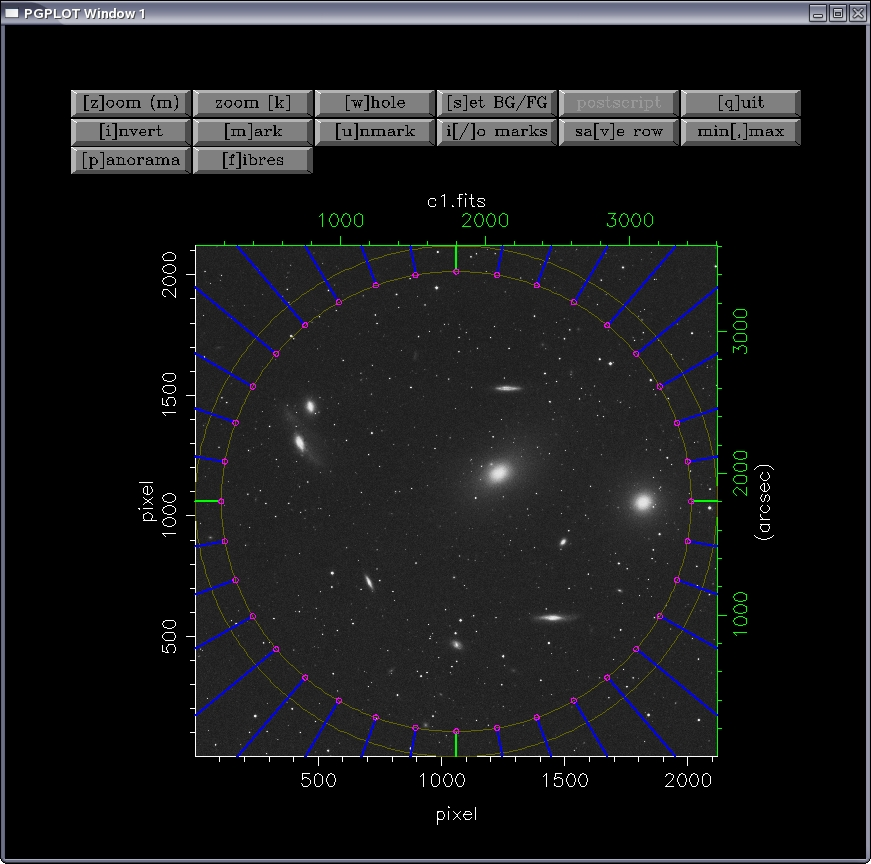

.. _description:

Description
============

The **octopus** program is designed to visualize fields and fibres at the same time. The objects positions to be observed and the fibre configuration can be stored in a results file. 

This is an example showing the program starting and the image *M8708wr.fits* loading:

::

    $ octopus
    
    **************************************************
    Welcome to octopus, the fibre spectrograph
    simulator of the UCM Department of Astrophysics
    **************************************************
    
    Press <CR> to start...
    Input file name? M8708wr.fits
    ................
    printing of fits header
    ................
    
    OK! File read.
    Background: 510.
    Foreground: 15832.
    > From Scan # 1 to 2119
    > From Channel # 1 to 2119
    > Total number of pixels: 4490161
    > Minimum: 510.
    --> in pixel:  1403  151
    > Maximum:  15832.
    --> in pixel:  216  1506
    > Mean : 3445.78638
    > Sigma :  1123.87659

    
**octopus** has different buttons in the graphic window that let the user perform operations like changing the *background* or *foreground*, *zooming* or file *sectioning*:

``invert``   Change the gray scale to inverse video

``zoom``     Zoom a given zone with the mouse cursor

``mark``     Put a mark with the cursor

``unmark``   Remove a previous cursor mark

``i/o marks`` Create and read files to store the marks

``fibres``   Enter in the fibre positioning mode

In this ``fibres`` mode the user can perform several operations that can be selected in a menu. Let's see an example where a fibre is selected with the cursor and centred in an object:

::

    (i) Load fibre configuration from file       # Load positions from a file
    (s) Save fibre configuration into file       # Save the configuration to a file
    (c) Locate fibre to cursor                   # Centre a fibre with the cursor
    (p) Park fibre                               # Park a fibre previously positioned
    (x) exit                                     # Exit fibre mode
    
    Option  (i/s/c/p/x) ?                        # Choose 'c' for cursor
    Select fibre head with mouse ...             # Click on a fibre
    OK! Fibre selected is # 35                   # It was fibre number 35
    Press mouse button in new fibre location...  # And the object is marked 
    Updating configuration.......OK!             # Program calculates the positioned
    ...OK!                                       # And centres the fibre in the marked point
    Cursor at 1495.19  970.54  Pixel value: 14692.
    (J2000.0) R.A.:  12 29 59.19  DEC.:  +12 20 53.04
    (B1950.0) R.A.:  12 27 27.31  DEC.:  +12 37 27.43
    
Input File
-----------

As a simple example to learn how to use **octpus** let's follow this exercise.
We have a fibre spectrograph that can position the fibres in a 40'-diameter field. We then have 32 fibres for the interesting objects and for the sky background, and another 4 for the guiding stars (*fiducial fibres*).

We will configure each field taking into account the following restrictions:

* At least 10 galaxies from the lists (:download:`list1<images/list1.pdf>`,
  :download:`list2<images/list2.pdf>`, :download:`list3<images/list3.pdf>`)
  should be pointed at.
* The 4 fiducial fibres (in green colour in the **octopus** window) will be 
  always positioned centred in the field stars.
* Four fibres should be centred in object-free zones to register the sky 
  background. They should be evenly distributed in the field.
* The fibres cannot intersect due to design mechanical problems. If two o more 
  fibres intersect, the program shows them in red colour and warns about the
  existence of a configuration problem. In this case, the conflicting fibre
  must be parked and another configuration should be used.

At the end, a file will be saved with the results for each field.

.. figure:: images/octopus_screenshot2.jpg
   :align: center
   :width: 80%  

Suggestions
-------------

The coordinates of an image area can be obtained positioning the mouse in this place and pressing the ``Tab`` key. Then **octopus** will show, in the alphanumeric window, the position in equatorial coordinates and for the B1950 an J2000 equinoxes. This system is very useful to locate one particular object.

The fibres that must be chosen are those closest to the object. In addition, the already positioned fibres must not be largely deviated from their radial orientation. This way the intersection and the conflicts can be avoided.

To position the fibres in the objects, option (c) should be used in the ``fibres`` mode with the full image (``whole``). This simplifies the fibres selection and positioning. Finally, the pointing is refined zoomimg the area of interest with ``zoom(m)`` and using again option (c) in the ``fibres`` mode.

Fibres are placed with the mouse but they can be used also with the keyboard arrows for a more precise pointing.

