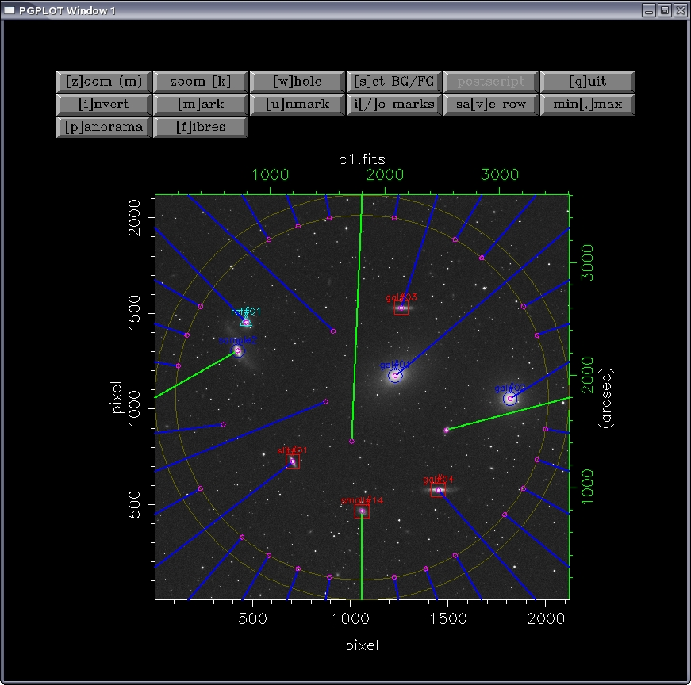

.. octopus documentation master file, created by
   sphinx-quickstart on Wed Jan  4 20:05:15 2017.
   You can adapt this file completely to your liking, but it should at least
   contain the root `toctree` directive.

Welcome to octopus's documentation!
===================================

**octopus** is a simulator of fibre spectrograph, developed by N. Cardiel
(cardiel@ucm.es) with the help of Sergio Pascual (sergiopr@fis.ucm.es), and
used as a teaching tool in the Astrophysics and Atmospheric Sciences
Departament of the Universidad Complutense de Madrid.

Documentation outline
---------------------

.. toctree::
   :maxdepth: 2

   description
   
